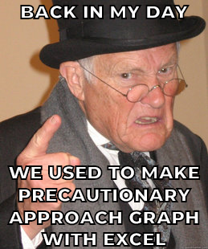

```{r, include=FALSE}
knitr::opts_chunk$set(
  collapse = T,
  comment = "#>",
  out.width = "100%"
)
```

```{r, out.width="60%", fig.align='center', echo = F}

```

<br>

This package allows you to easily and quickly make a precautionary approach graph with a simple dataset.

## Installation 

The installation requires beforehand to install devtools, than you can install and load "precAppGraph"

```{r, eval = F}
library(devtools)
install_github("MathieuGenu/precAppGraph")
```


## Usage

# Herring dataset

A dataset is included in the package, it corresponds to the Herring fishery data of the greater north sea ecoregion (https://www.ices.dk/). The data set contains a data.frame and 4 parameters required to make a precautionary approach graph :

The dataframe contains the following columns : 

* Year
* R
* SSB
* F

needed to use the graph function.

```{r, echo = F, message = F}
library(precAppGraph)
library(tidyverse)
library(knitr)
Herring_ICES$Herring_data %>% 
  as_tibble() %>% 
  head() %>% 
  kable()
  
```
<br>

# Graph

To make the graph use the function pa_graph().
```{r, fig.retina=3}
DF_fish <- Herring_ICES$Herring_data
Fpa <- Herring_ICES$Fpa
Bpa <- Herring_ICES$Bpa
Flim <- Herring_ICES$Flim
Blim <- Herring_ICES$Blim

NS_herring_pa <- pa_graph(
  fish_data = DF_fish,
  Fpa = Fpa,
  Bpa = Bpa,
  Flim = Flim,
  Blim = Blim
)

```

# Customisation

pa_graph has a ggplot object in output, therefore, it is easy to modify it and add title, change labels,...

```{r, fig.retina=3}
library(grid)
herr_jpeg <- jpeg::readJPEG("img/Clupea_harengus_Gervais.jpg")

NS_herring_pa +
  annotation_custom(rasterGrob(herr_jpeg), 
                    xmin = 0.8,
                    xmax = 1.2,
                    ymin = 4e6,
                    ymax = 5e6)
```

