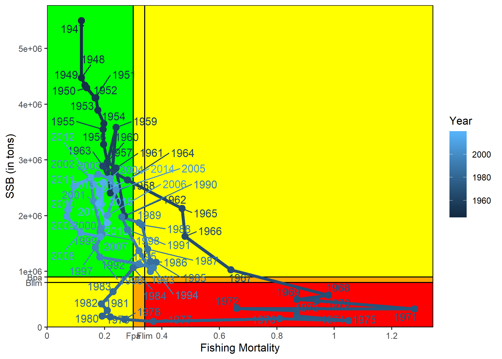
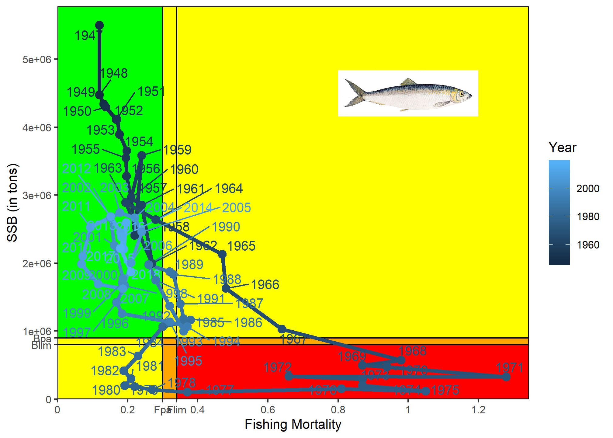

precAppGraph package
================


<br>

This package allows you to easily and quickly make a precautionnary
approach graph with a simple dataset.

## Installation

The installation require beforehand to install devtools, than you can
install and load “precAppGraph”

``` r
library(devtools)
install_github("MathieuGenu/precAppGraph")
```

## Usage

# Herring dataset

A dataset is included in the package, it correspond to the Herring
fishery data of the greater north sea ecoregion
(<https://www.ices.dk/>). The data set contains a data.frame and 4
parameters required to make a precautionary approach graph :

The dataframe contains the following columns :

  - Year
  - R
  - SSB
  - F

needed to use the graph function.

| Year |        R |     SSB |     F | Total\_catch |
| ---: | -------: | ------: | ----: | -----------: |
| 1947 | 56498800 | 5499130 | 0.120 |       581760 |
| 1948 | 56131100 | 4474570 | 0.120 |       502100 |
| 1949 | 50827000 | 4340320 | 0.132 |       508500 |
| 1950 | 69744900 | 4292960 | 0.138 |       491700 |
| 1951 | 62253800 | 4110430 | 0.167 |       600400 |
| 1952 | 59223700 | 4115720 | 0.170 |       664400 |
| <br> |          |         |       |              |

# Graph

To make the graph use the function pa\_graph().

``` r
DF_fish <- Herring_ICES$Herring_data
Fpa <- Herring_ICES$Fpa
Bpa <- Herring_ICES$Bpa
Flim <- Herring_ICES$Flim
Blim <- Herring_ICES$Blim

NS_herring_pa <- pa_graph(
  fish_data = DF_fish,
  Fpa = Fpa,
  Bpa = Bpa,
  Flim = Flim,
  Blim = Blim
)
```



# customisation

pa\_graph has a ggplot object in output, therefore, it is easy to modify
it and add title, change labels,…

``` r
library(grid)
herr_jpeg <- jpeg::readJPEG("img/Clupea_harengus_Gervais.jpg")

NS_herring_pa +
  annotation_custom(rasterGrob(herr_jpeg), 
                    xmin = 0.8,
                    xmax = 1.2,
                    ymin = 4e6,
                    ymax = 5e6)
```


